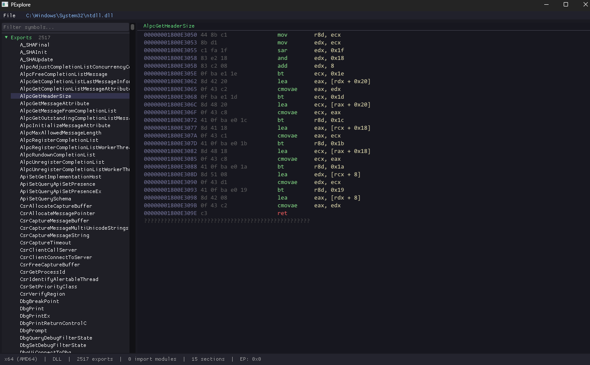

# PExplore

> PE file inspector and disassembler.

---

## Overview

`PExplore` is a lightweight GUI tool for inspecting and disassembling Windows Portable Executable files.

It provides a fast, minimal interface to explore:

* exports
* imports
* sections
* disassembled code

---

## Features

* open `.exe`, `.dll`, `.sys`, `.ocx`, `.efi`
* export table viewer with disassembly
* import tree (modules + functions)
* section viewer (flags, sizes, memory layout)
* fast symbol filtering
* drag & drop support
* simple disassembler view (colored, readable)

---

## Usage

Launch the application and:

* drag & drop a PE file
  **or**
* `File → Open`

then:

* Browse exports/imports/sections on the left
* Click an exported function to disassemble it

---

## Structure

* `PeParser` → parses PE headers and tables
* `Disassembler` → decodes instructions
* `App` → UI + interaction (ImGui)

---

## Screenshot

---

## philosophy

`pedump` is meant to be:

* small
* fast
* readable
* useful

not a full reverse engineering suite — just a solid tool.

---

## license

MIT